<!--
 ╔═══════════════════════════════════════════════════════════════╗
 ║   GRIMÓRIO DE PERFIL · @LaioBomfimDev (Bruxo)                  ║
 ║   Tema: Minimalista · Dark Fantasy & Fogo Verde WoW (Fel Fire) ║
 ╚═══════════════════════════════════════════════════════════════╝
-->

<!-- ╭─ BANNER / CAPA ANIMADA PERSONALIZADA (FOGO VERDE WOW) ─╮ -->

<!-- ╭─ SUBTÍTULO COM EFEITO DE DIGITAÇÃO ─╮ -->

<!-- ╭─ CONTADORES ─╮ -->

  

## 🧙‍♂️ Salve, viajante! Você encontrou o grimório de **Laio Bomfim**.
> *_Conhecido no digital como **Bruxo**._*

---

Sou um **Desenvolvedor Fullstack** focado em forjar sites, landing pages, web apps e sistemas sob medida. Movido a café e madrugadas invocando magias na calada da noite para transformar ideias complexas em realidade.

### 🔮 Minhas Conjurações (O que eu faço)
* **Arquiteturas e Sistemas:** Desenvolvimento de web apps e sistemas robustos sob medida.
* **Visuais (UI/UX):** Foco em experiências *Mobile First*, interfaces modernas com Glassmorphism e Bento Grids.
* **Conjurador (IA):** Explorando ferramentas de desenvolvimento com agentes de IA e automação.

### 📜 Ferramentas do Ofício
* **Linguagens & Frameworks:** `JavaScript`, `TypeScript`, `Python`, `React`, `Next.js`, `Vue.js`, `Node.js`, `Express`, `NestJS`, `Django`, `FastAPI`, `Tailwind CSS`
* **Ferramentas & Banco de Dados:** `PostgreSQL`, `MySQL`, `Git`, `GitHub`, `VS Code`

---

### 🕯️ Invocar o Bruxo · _Summon Me_

